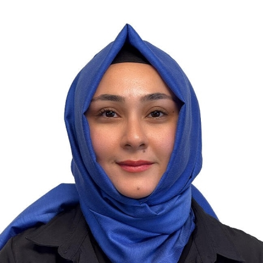

{width="199"}

# Eğitim

-   Yüksek Lisans - Hacettepe Üniversitesi - Mühendislik Yönetimi
-   Lisans - Kırıkkale Üniversitesi - Bilgisayar Mühendisliği Bölümü
-   Lise - Çağlayan Anadolu Lisesi

# İş Tecrübesi

1.  Bites Defence / Aselsan Akyurt Yerleşkesi - Aviyonik Yazılım Test Uzmanı \>2026

2.  Taskin Logistics - Yazılım Uzmanı \> 2022

# Staj

1.  Türk Telekom - Stajyer - 2018

2.  Başarsoft - Stajyer - 2017

# Sertifikalar

1.  ISTQB Foundation Level

[Detaylı CV](C:\Users\pakiz\OneDrive\Belgeler\GitHub\muy665-bahar2026-pakizzz)
